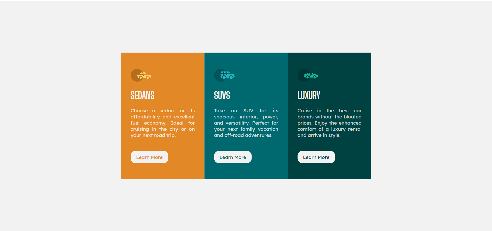

# 3-column preview card component solution

This is a solution to the [3-column preview card component challenge on Frontend Mentor](https://www.frontendmentor.io/challenges/3column-preview-card-component-pH92eAR2-).

## Table of contents

- [Overview](#overview)
  - [The challenge](#the-challenge)
  - [Screenshot](#screenshot)
  - [Links](#links)
- [My process](#my-process)
  - [Built with](#built-with)
  - [What I learned](#what-i-learned)
  - [Useful resources](#useful-resources)
- [Author](#author)

## Overview

### The challenge

Users should be able to:

- View the optimal layout depending on their device's screen size
- See hover states for interactive elements

### Screenshot



### Links

- [My solution](https://github.com/minhlong149/3-column-preview-card-component-main)
- [Live site](https://minhlong149.github.io/3-column-preview-card-component-main/)

## My process

### Built with

- Semantic HTML5 markup
- CSS custom properties
- Flexbox

### What I learned

Basic use of Flexbox:
```css
.component {
  display: flex;
  justify-content: center;
  align-items: center;
}
```

Using CSS custom properties:
```css
:root {
  /* ---Primary colors--- */
  --bright-orange: hsl(31, 77%, 52%);
  --dark-cyan: hsl(184, 100%, 22%);
  --very-dark-cyan: hsl(179, 100%, 13%);
  /* ---Neutral colors--- */
  --transparent-white: hsla(0, 0%, 100%, 0.75); /* Paragraphs */
  --light-gray: hsl(0, 0%, 95%); /* Background, headings, buttons */
}
```
```css
body {
  color: var(--transparent-white);
  background-color: var(--light-gray);
}
```
Center an element vertically:
```css
.centered {
  position: fixed;
  top: 50%;
  left: 50%;
  transform: translate(-50%, -50%);
}
```
And playing with buttons:
```css
.btn {
  display: inline-block;
  padding: 0.5em 1em;
  background-color: var(--light-gray);
  border: solid 2px white;
  border-radius: 1em;
  text-decoration: none;
}

.btn:hover {
  background-color: transparent;
  color: var(--light-gray);
}
```

### Useful resources

- [CSS-Tricks](https://css-tricks.com/centering-css-complete-guide/) - This helped me for centering the card. I really liked this pattern.
- [CSS Essential Training](https://www.linkedin.com/learning/css-essential-training-3) - This is an amazing course which helped me finally understand the concept of Flexbox. I'd recommend it to anyone still learning this concept.

## Author

- Github - [Long Nguyen](https://github.com/minhlong149)
